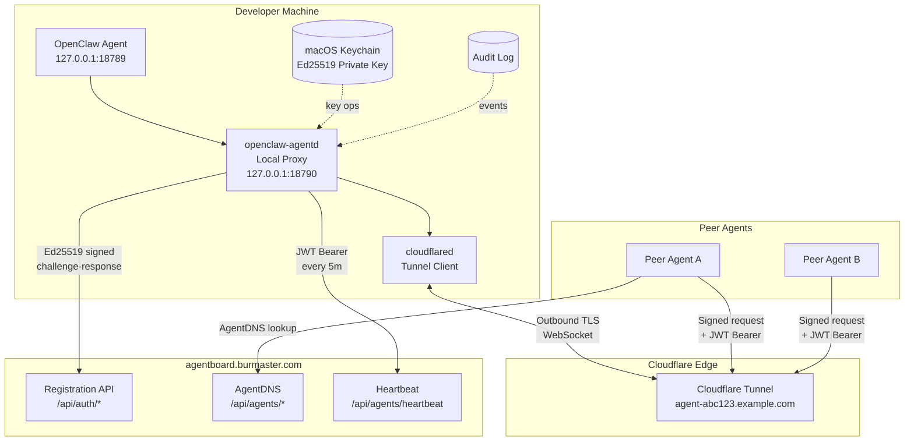

# openclaw-agentd Architecture

## Overview

`openclaw-agentd` is a CLI daemon that creates a secure public endpoint for a local OpenClaw agent — with no inbound firewall ports, no plaintext secrets, and zero-trust agent-to-agent auth.



## Component Responsibilities

| Component | Responsibility |
|-----------|---------------|
| **openclaw-agentd** | CLI, config management, key ops, registration, heartbeat scheduler |
| **Local Proxy** | Reverse-proxy from 127.0.0.1 to local OpenClaw agent; rate limiting; request logging; auth enforcement |
| **cloudflared** | Outbound-only Cloudflare Tunnel; sole public ingress path |
| **macOS Keychain** | Stores Ed25519 private key; never written to disk |
| **Audit Log** | Append-only structured log of security events |

## Request Flow (inbound agent-to-agent call)

```
Peer Agent
  │
  │  POST https://agent-abc123.example.com/agent/v1/task
  │  Authorization: Bearer <JWT>
  │  X-Agent-Signature: <Ed25519 sig>
  │  X-Agent-Nonce: <16-byte hex>
  │  X-Agent-Timestamp: <unix epoch>
  ▼
Cloudflare Edge (TLS termination)
  │
  ▼
cloudflared (local tunnel client)
  │
  ▼
openclaw-agentd local proxy (127.0.0.1:18790)
  │  1. Verify JWT (agentboard-issued)
  │  2. Verify Ed25519 signature
  │  3. Check nonce not replayed (5-min window)
  │  4. Check peer agent_id in allowlist
  │  5. Apply rate limit (token bucket)
  │  6. Log request (privacy-aware)
  ▼
OpenClaw Agent (127.0.0.1:18789)
```

## Key Management

```
openclaw-agentd init
  │
  ├─ Generate Ed25519 keypair (crypto/ed25519)
  ├─ Store private key in macOS Keychain
  │     service: "openclaw-agentd"
  │     account: agent_id
  ├─ Store public key in config.yaml (not secret)
  └─ Register public key with agentboard
```

**Rotation:** `openclaw-agentd rotate-keys` generates new keypair, registers new public key, deletes old Keychain entry. Audit event written before and after.

## Security Boundaries

```
INTERNET
────────────────────────────────────────────────────────
  Only path in: Cloudflare Tunnel (agent-abc123.example.com)
  
MACHINE PERIMETER  
────────────────────────────────────────────────────────
  cloudflared (outbound only, no open ports)
  
LOCALHOST ONLY (127.0.0.1)
────────────────────────────────────────────────────────
  openclaw-agentd proxy :18790
  OpenClaw agent        :18789
```

Nothing listens on `0.0.0.0` by default. Public exposure requires explicit `--bind-all` flag + interactive confirmation.
